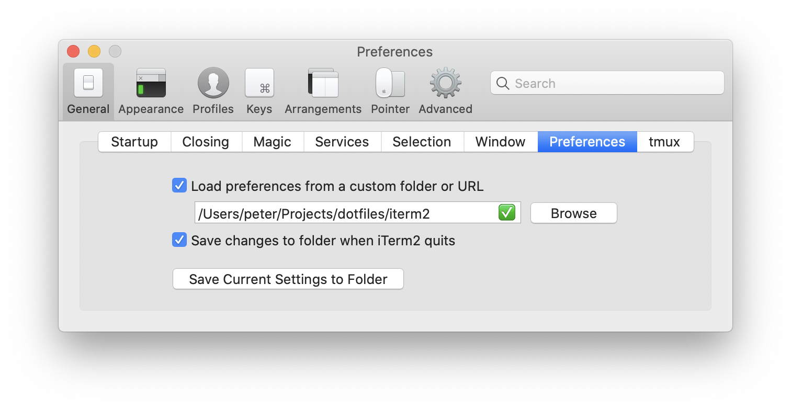

# dotfiles

## Stowing a config

```
$ cd ~/Projects/dotfiles
$ mkdir newconf
$ cp ~/.newconfrc ./newconf/
$ stow --restow --target ~ newconf
```

## iTerm2 Settings

iterm2 config isn't stowable, it has to be loaded manually:



